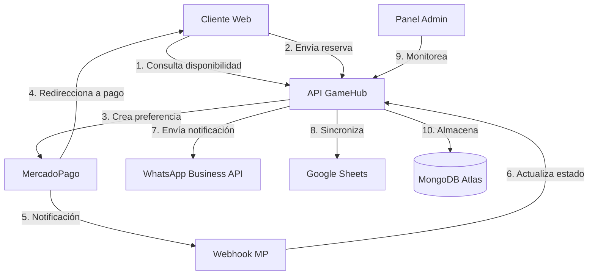
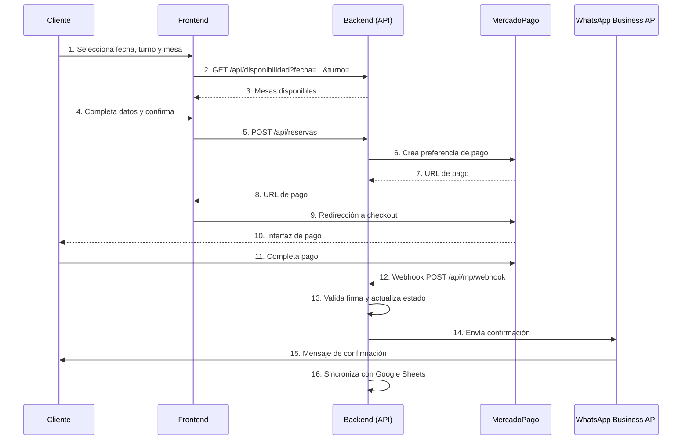
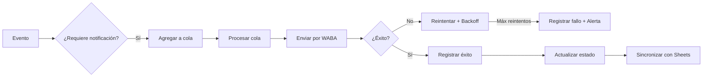
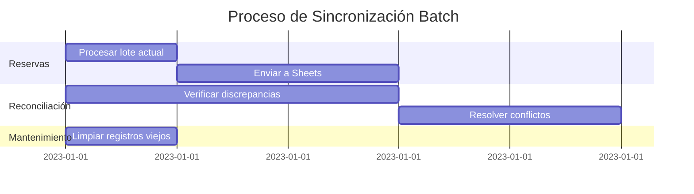
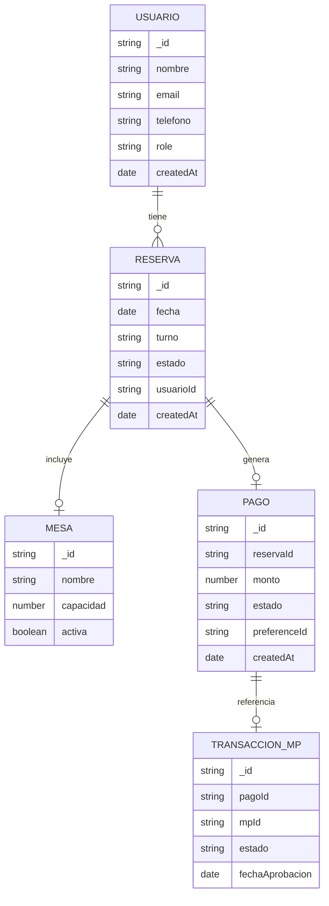
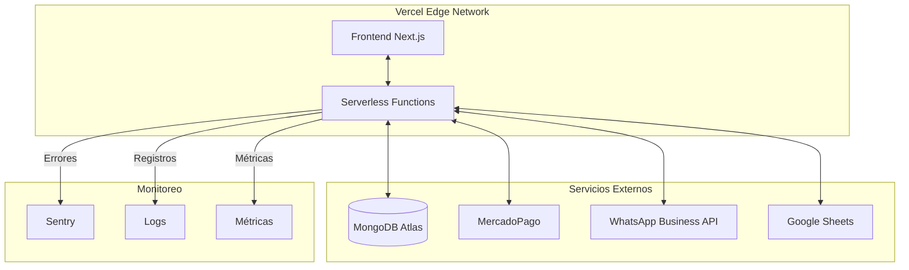
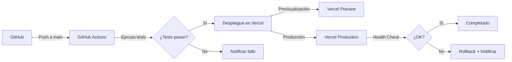

# Arquitectura del Sistema GameHub

## Diagrama de Alto Nivel

## Flujo de Reserva

## Flujo de Notificaciones

## Sincronización con Google Sheets

## Estructura de la Base de Datos

### Diagrama Entidad-Relación

## Infraestructura

## Flujo de Despliegue

## Consideraciones de Escalabilidad

1. **Frontend**:
   - Generación estática para páginas públicas
   - Server Components para datos dinámicos
   - CDN global con Vercel Edge Network

2. **Backend**:
   - Funciones serverless escalables automáticamente
   - Conexiones a MongoDB optimizadas
   - Caché de consultas frecuentes

3. **Base de Datos**:
   - Índices optimizados para consultas frecuentes
   - TTL para datos temporales
   - Sharding horizontal si es necesario

4. **Procesamiento Asíncrono**:
   - Colas para tareas pesadas (notificaciones, sincronización)
   - Reintentos con backoff exponencial
   - Dead Letter Queues para mensajes fallidos
