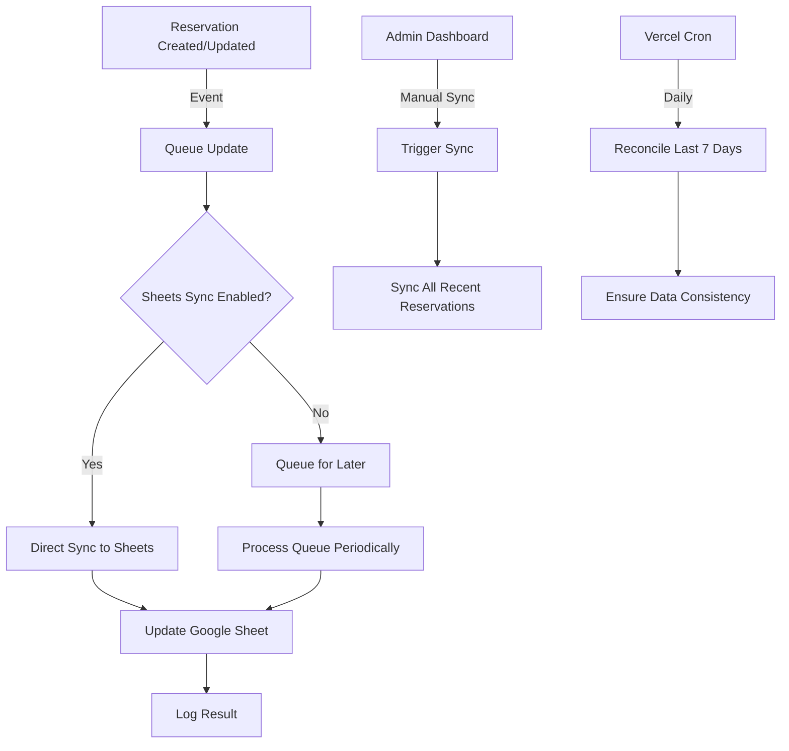

# Google Sheets Synchronization

This document outlines the Google Sheets synchronization feature for the GameHub reservation system.

## Overview

The Google Sheets synchronization feature provides a reliable way to keep reservation data in sync between the application database and a Google Sheet. This is useful for:

- Backup and reporting
- Manual data manipulation
- Integration with other systems
- Data analysis

## Architecture



## Configuration

### Environment Variables

```env
# Google Sheets Integration
SPREADSHEET_ID=your-spreadsheet-id
GOOGLE_SERVICE_ACCOUNT_JSON={"type": "service_account", ...}
SHEETS_SYNC_ENABLED=true

# Sync Behavior
SHEETS_SYNC_BATCH_SIZE=10
SHEETS_SYNC_DELAY_MS=5000
SHEETS_MAX_RETRIES=3
SHEETS_RETRY_DELAY_MS=1000
```

### Sheet Structure

The Google Sheet should have the following columns:

| Column | Type | Description |
|--------|------|-------------|
| reserva_uuid | String | Unique reservation ID |
| fecha_iso | Date | Reservation date (YYYY-MM-DD) |
| turno_label | String | Time slot (e.g., "19:00-21:00") |
| mesa_num | Number | Table number |
| cliente_nombre | String | Customer name |
| cliente_telefono | String | Customer phone |
| cliente_email | String | Customer email |
| personas | Number | Number of people |
| juego | String | Selected game (optional) |
| estado | String | Reservation status |
| pago_id | String | Payment ID (if any) |
| monto_ars | Number | Amount in ARS (if paid) |
| updated_at_iso | DateTime | Last update timestamp |
| idempotency_key | String | For deduplication |
| notas | String | Additional notes |

## API Endpoints

### Manual Sync Endpoint

`POST /api/sync/sheets`

Trigger a manual synchronization of recent reservations.

**Request Body (optional):**
```json
{
  "days": 1
}
```

**Response:**
```json
{
  "success": true,
  "stats": {
    "total": 5,
    "appended": 2,
    "updated": 3,
    "noop": 0,
    "errors": 0
  },
  "syncedAt": "2025-08-13T13:24:18.123Z"
}
```

### Daily Reconciliation (Cron)

`GET /api/cron/reconcile-sheets`

Automatically reconciles reservations from the last 7 days. Called daily by Vercel Cron.

## Error Handling

### Retry Mechanism

- **Exponential Backoff**: Retries use exponential backoff with jitter
- **Max Retries**: Configurable via `SHEETS_MAX_RETRIES` (default: 3)
- **Non-Retriable Errors**: 4xx errors (except 429) are not retried

### Error Logging

All errors are logged with structured context:
- Timestamp
- Error message and stack trace
- Operation type
- Reservation ID (if applicable)
- Retry attempt

## Monitoring

### Logs

Key events are logged with the following structure:

```json
{
  "level": "info",
  "message": "Sheets sync completed",
  "operation": "batchUpsert",
  "stats": {
    "total": 5,
    "appended": 2,
    "updated": 3,
    "noop": 0,
    "errors": 0
  },
  "durationMs": 1234,
  "timestamp": "2025-08-13T13:24:18.123Z"
}
```

### Metrics

The following metrics are tracked:
- `sheets_sync_operations_total` (counter)
- `sheets_sync_duration_seconds` (histogram)
- `sheets_sync_errors_total` (counter)
- `sheets_queue_size` (gauge)

## Security Considerations

1. **Service Account**: Uses a dedicated Google Service Account with least privilege
2. **Environment Variables**: Sensitive data is stored in environment variables
3. **Rate Limiting**: Implements backoff to respect Google Sheets API limits
4. **Input Validation**: All inputs are validated before processing
5. **Error Handling**: Failures are logged and don't block the main application flow

## Troubleshooting

### Common Issues

1. **Authentication Errors**
   - Verify `GOOGLE_SERVICE_ACCOUNT_JSON` is properly formatted
   - Ensure the service account has edit access to the spreadsheet

2. **Permission Denied**
   - Check if the spreadsheet is shared with the service account email
   - Verify the spreadsheet ID is correct

3. **Rate Limiting**
   - Reduce batch size or increase delay between operations
   - Implement caching for read operations

### Debugging

1. Check application logs for detailed error messages
2. Verify the Google Sheets audit logs in the Google Cloud Console
3. Test with a single record using the manual sync endpoint

## Future Enhancements

1. **Batch Processing**: Process updates in larger batches for better performance
2. **Incremental Sync**: Only sync changes since last successful sync
3. **Conflict Resolution**: Handle conflicts when the same record is modified in both systems
4. **Webhook Support**: Allow Google Sheets to trigger updates back to the application
5. **Sync Status Dashboard**: Real-time view of sync status and metrics
