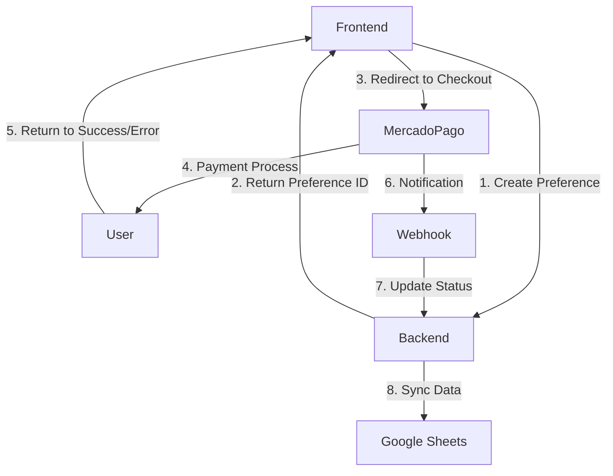

# MercadoPago Integration Guide

This document provides a comprehensive guide to the MercadoPago payment integration in the GameHub reservation system.

## Table of Contents
- [Overview](#overview)
- [Architecture](#architecture)
- [Integration Flow](#integration-flow)
- [API Endpoints](#api-endpoints)
- [Webhook Handling](#webhook-handling)
- [Payment Expiry](#payment-expiry)
- [Security Considerations](#security-considerations)
- [Testing](#testing)
- [Troubleshooting](#troubleshooting)

## Overview

The MercadoPago integration allows GameHub to process online payments for reservations. It uses MercadoPago Checkout Pro for a seamless payment experience and implements webhooks for payment status updates.

## Architecture



## Integration Flow

### 1. Creating a Payment Preference

When a user initiates a reservation:

1. Frontend sends reservation details to `/api/reservas`
2. Backend creates a MercadoPago preference
3. Backend saves the preference ID with the reservation
4. Frontend receives the preference ID and initializes the checkout

### 2. Processing the Payment

1. User completes payment on MercadoPago's hosted checkout
2. User is redirected back to the specified return URL
3. MercadoPago sends a webhook notification with payment status
4. System updates the reservation status based on payment result

## API Endpoints

### Create Reservation & Payment Preference

```http
POST /api/reservas
Content-Type: application/json

{
  "fecha": "2025-08-15",
  "turno": "noche",
  "personas": 4,
  "nombre": "John Doe",
  "telefono": "+5491123456789",
  "email": "john@example.com"
}
```

**Response:**
```json
{
  "success": true,
  "reservaId": "507f1f77bcf86cd799439011",
  "preferenceId": "123456789-abc123-456-def",
  "init_point": "https://www.mercadopago.com.ar/checkout/v1/redirect?pref_id=..."
}
```

### Webhook Endpoint

```http
POST /api/webhooks/mercadopago
X-Signature: ts=1234567890,v1=abc123...
Content-Type: application/json

{
  "action": "payment.updated",
  "api_version": "v1",
  "data": { "id": "1234567890" },
  "date_created": "2025-08-12T15:30:45Z",
  "id": 1234567890,
  "live_mode": true,
  "type": "payment",
  "user_id": "123456789"
}
```

## Webhook Handling

The system processes the following payment statuses:

| Status | Description | Reservation Status |
|--------|-------------|-------------------|
| approved | Payment approved | confirmada |
| pending | Payment in process | pendiente_pago |
| in_process | Payment in review | pendiente_pago |
| rejected | Payment rejected | cancelada |
| cancelled | Payment cancelled | cancelada |
| refunded | Payment refunded | cancelada |
| charged_back | Payment charged back | cancelada |

## Payment Expiry

- Payments expire after **15 minutes** of being created
- The system automatically cancels unpaid reservations after expiration
- Users can retry payment if they don't complete it in time
- Expired reservations free up the table for other customers

## Security Considerations

### Webhook Security
- All webhook requests are verified using HMAC-SHA256 signatures
- The `X-Signature` header must be present and valid
- The webhook secret is stored in `MERCADOPAGO_WEBHOOK_SECRET`

### Data Validation
- All input is validated and sanitized
- Payment data is validated against expected schema
- SQL injection prevention measures are in place

### Sensitive Data
- No sensitive card data is stored
- Only payment IDs and statuses are saved
- API keys are stored in environment variables

## Testing

### Unit Tests

Run the test suite:

```bash
npm test
```

### Sandbox Environment

1. Set `NEXT_PUBLIC_MP_PUBLIC_KEY` to your sandbox public key
2. Set `MP_ACCESS_TOKEN` to your sandbox access token
3. Use test cards from [MercadoPago docs](https://www.mercadopago.com.ar/developers/en/guides/online-payments/checkout-pro/test-integration)

### Test Cards

| Card Number | Status | CVV | Date |
|-------------|--------|-----|------|
| 4509 9535 6623 3704 | Approved | Any 3 digits | Any future date |
| 5031 7557 3453 0604 | Pending | Any 3 digits | Any future date |
| 6034 9377 6000 0004 | Rejected | Any 3 digits | Any future date |

## Troubleshooting

### Common Issues

**Webhook not received**
- Verify the webhook URL is correctly configured in MercadoPago
- Check server logs for errors
- Ensure the endpoint is accessible from the internet

**Invalid signature**
- Verify `MERCADOPAGO_WEBHOOK_SECRET` matches the one in MercadoPago
- Ensure the raw request body is used for signature verification

**Payment not updating**
- Check the webhook logs for errors
- Verify the payment exists in MercadoPago
- Ensure the reservation ID matches the external reference

### Logs

Key log events to monitor:
- Payment preference creation
- Webhook received and processed
- Payment status changes
- Error conditions

## Support

For issues with the MercadoPago integration, please contact:
- Development Team: dev@gamehub.com
- MercadoPago Support: https://www.mercadopago.com.ar/developers/en/support

## Changelog

### 1.0.0 (2025-08-12)
- Initial implementation of MercadoPago Checkout Pro
- Webhook handling for payment status updates
- Payment expiry and retry logic
- Comprehensive test coverage
- Security validations and logging
